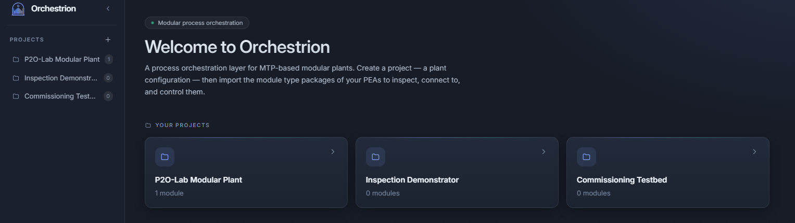
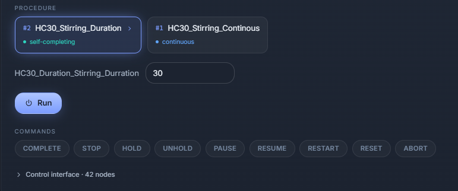
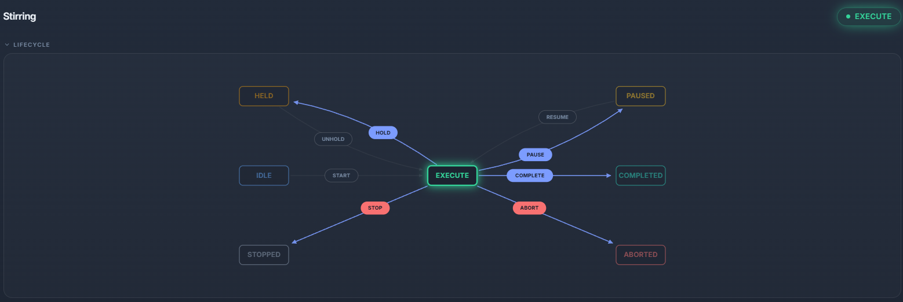
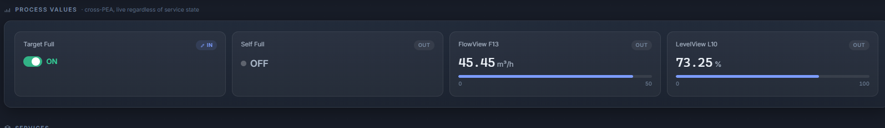
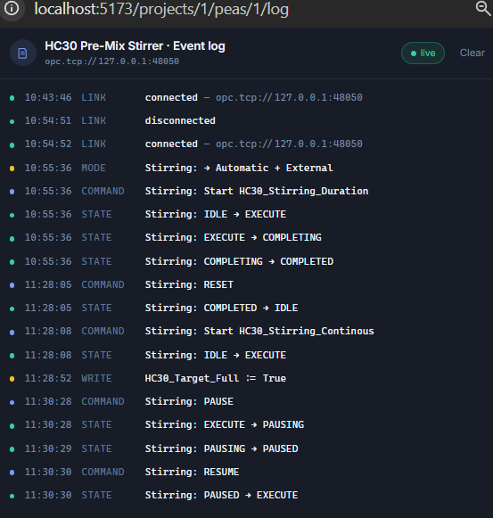
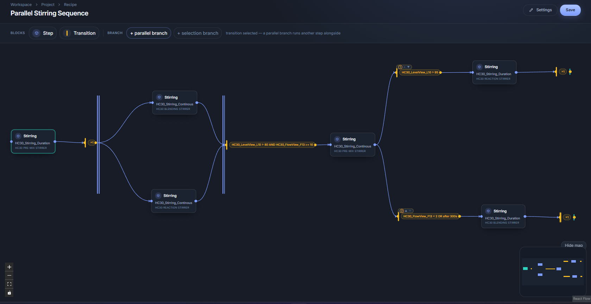
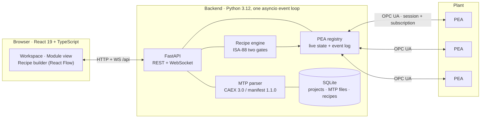

<div align="center">


# Orchestrion

**An open-source Process Orchestration Layer for MTP-based modular process plants.**

Import a module's MTP file, drive its services over OPC UA, draw an ISA-88 recipe across several
modules, and watch it run.

[](LICENSE)
[](https://www.python.org/)
[](https://react.dev/)
[](https://www.vdi.de/)
[](https://www.iec.ch/)
[](#-testing)

</div>

---

## 🎯 The problem

The process industries — pharmaceutical, fine and specialty chemicals, food and beverage, cosmetics
— are built on plants that take years to engineer and are then difficult to change. **Modularity** is
the young but fast-moving answer to that. Instead of one monolithic installation, the plant is
assembled from **Process Equipment Assemblies (PEAs)**: self-contained, pre-engineered and
pre-validated units, each shipping with its own automation and a vendor-neutral **Module Type Package
(MTP)** describing the services it offers. The gain is large on both axes that matter — **time to
deployment**, because a module arrives working rather than being commissioned in place, and
**flexibility**, because a process line can be re-composed instead of rebuilt.

Building a PEA is only half of it. VDI/VDE/NAMUR 2658 deliberately stops at the module boundary: a
PEA does nothing on its own and waits to be told. Driving a **plant** of them — holding the sessions,
sequencing the services, running the recipe — requires a **Process Orchestration Layer (POL)** above
them.

**And that is where modularity gets expensive.** Nearly every POL available today is commercial:
capable and mature, but licensed, costly, and delivered inside a particular vendor's control system.
A laboratory, a research group or a smaller producer cannot simply obtain one and run it, so the
orchestration layer becomes the thing that stalls the adoption of a technology whose whole promise
was lower barriers.

**Orchestrion exists to remove that barrier.** It is an open-source POL, built to the standards
rather than around them — **VDI/VDE/NAMUR 2658** for the module interface and **ISA-88 / IEC 61512-1**
for the recipes — and deliberately ambitious about what an open orchestration layer should offer: a
real drag-and-drop recipe editor, live supervision of every module in the plant, a full event log,
and delivery as a web application so any station on the plant network is an operator station.

> [!NOTE]
> Developed at the **Chair of Process Control Systems (P2O-Lab), TU Dresden**. The standards are the
> specification throughout: every standards-driven constant, node name, encoding and behaviour
> carries its clause reference at the site that implements it, for example `# [2658-4:2022 Table 14]`.

---

## ✨ What it does

<table>
<tr>
<td width="50%" valign="top">

### 📦 Ingest a module
Upload an MTP file and the layer recovers the services, procedures, parameters, OPC UA endpoint and
node addresses the module declares. **No address is ever typed by an operator.** A file that breaks a
modelling rule is refused, naming the rule.

</td>
<td width="50%" valign="top">

### 🔌 Connect and supervise
One OPC UA session per module, held by the backend. Namespaces resolved **by URI** at every
connection, one subscription over states, admitted commands and live values, and a health task that
notices a module that has died.

</td>
</tr>
<tr>
<td width="50%" valign="top">

### 🎛️ Command a service
The full 16-state service lifecycle, drawn as an **interactive chart**. Mode handshake, source
handshake and command word happen underneath, so driving a service needs no knowledge of the nodes
below it.

</td>
<td width="50%" valign="top">

### 🧩 Compose a recipe
An ISA-88 master recipe on a graph canvas — sequences, parallel branches, synchronisations and
prioritised selections, across any number of modules. Every list is populated from what the modules
themselves declare.

</td>
</tr>
<tr>
<td width="50%" valign="top">

### ▶️ Run and watch it
The engine drives each step through the real handshake, honours ISA-88's **two gates**, sends
`COMPLETE` to continuous procedures, and reports per-step state so the chart lights up as the batch
advances.

</td>
<td width="50%" valign="top">

### 🧪 Test without hardware
A **VirtualPEA** ships with the project: a conformant OPC UA server whose address space is generated
from a real vendor MTP export. One command serves an N-module plant.

</td>
</tr>
</table>

---

## 🚀 Quick start

> **Prerequisites** — Python **3.12+** and Node **20+**. Nothing else: no database server to
> provision, no broker, no message bus.

**1 · Clone**

```bash
git clone https://github.com/marwendh/Orchestrion.git
cd Orchestrion
```

**2 · Backend**

```bash
cd backend
python -m venv .venv
source .venv/bin/activate          # Windows:  .venv\Scripts\activate
pip install -e ".[dev]"

uvicorn orchestrion.main:app --reload --port 8000
```

The API is on `http://127.0.0.1:8000`, with OpenAPI docs at `/docs`.

**3 · Frontend**

```bash
cd frontend
npm install
npm run dev
```

Open **http://localhost:5173**. Vite proxies `/api/*` (REST **and** the WebSocket) to the backend.

**4 · A simulated plant** 🏭

You do not need real equipment to try Orchestrion. This serves three conformant OPC UA modules from
one process:

```bash
cd backend
python -m virtual_pea.plant --count 3
```

```
serving 3 PEAs:
  opc.tcp://127.0.0.1:48050   backend/virtual_pea/manifests/HC30_48050.aml
  opc.tcp://127.0.0.1:48051   backend/virtual_pea/manifests/HC30_48051.aml
  opc.tcp://127.0.0.1:48052   backend/virtual_pea/manifests/HC30_48052.aml

Import these files as separate PEAs, then Connect each. Ctrl+C to stop.
```

<details>
<summary><b>How the plant launcher works, and its options</b></summary>

<br>

An MTP file carries its own OPC UA endpoint **inside** the `.aml`, so N running instances need N
files. The launcher derives one manifest per port from the bundled stirring-module export, writes
them to `backend/virtual_pea/manifests/`, and serves them all on one event loop — so a single
`Ctrl+C` stops the whole plant with no orphaned processes left behind.

| Option | Meaning |
|---|---|
| `--count N` | How many modules to serve (default `3`) |
| `--all` | Serve every manifest in the folder, ignoring `--count` |
| `--base-port P` | Lowest port to allocate from (default `48050`) |
| `--dir PATH` | Where the manifests live |
| `--verbose` | Show asyncua's own INFO logging (very noisy) |

Existing manifests are reused rather than rewritten, and gaps in the port range are filled before new
ports are allocated. A single module on the default port is also available directly:

```bash
python -m virtual_pea.run                                  # opc.tcp://127.0.0.1:48050
python -m virtual_pea.run --endpoint opc.tcp://0.0.0.0:48055
```

</details>

**5 · Drive it** — create a project, import the manifests above, press **Connect**, then author a
recipe and press **Run**.

---

## 🖥️ Using it

### Projects and modules

A project is one plant configuration: the modules that belong together and the recipes written over
them. Several exist at once, so a laboratory plant, a demonstration rig and a commissioning bench do
not interfere.



A module is added by uploading its MTP file, and nothing else — no endpoint typed, no service
declared, no node configured. If the file parses, the module appears with the endpoint and the
services it declared; if it does not, the layer reports the modelling rule the file broke and stores
nothing. Import also **warns when two modules share an OPC UA endpoint**, which in a plant of
instances is almost always a mistake.

The three modules above are one module type imported three times, which is how a modular plant is
built: one engineered type, instantiated as often as the process needs it, each instance operated
independently.

### Driving a service

Running a service means choosing one of its procedures, giving that procedure its parameters, and
sending the start command.

<div align="center">

</div>

Every procedure the service declares is offered as a card, each parameter appears with the type and
limits the module's own description gives it, and the command row below shows exactly the commands
the service will accept at that moment. The interface also states which of the two **procedure kinds**
each one is, because the file declares it: one runs for the duration it is given and stops by itself,
the other runs until something stops it. That distinction governs everything a recipe step built on
it does later.

Pressing **Start** does not write a command word. The layer puts the module into automatic mode with
an external source, confirms both, writes the procedure number and reads it back, writes each
parameter and applies it, and only then sends `Start` and waits for the service to leave `IDLE`.

### Following a service on its lifecycle

The 16-state service lifecycle of VDI/VDE/NAMUR 2658 Part 4, drawn as an interactive diagram rather
than a picture. It shows the state the service is in, every state it can move to, and the command
that causes each move. A command the module currently admits is lit and clickable; the rest are
greyed out and inert.



That is what makes the chart worth building rather than drawing. Changing a service's state means
putting the module into the right mode, confirming it, and writing a command word to the right node.
On this chart the operator clicks the transition and the layer does all of it, so driving a service
requires knowing what the service should do next and nothing about the nodes underneath.

### Live values

A module also offers values, and they are live whether a service is running or not.



Each carries its own engineering unit, scale range or state labels, because the module's description
declares them, so an operator reads the equipment's condition off the panel instead of interpreting
raw numbers. The stirring module publishes flow in m³/h, vessel level as a percentage, and two binary
values — one of which the layer can write, which is why the interface makes only that one editable.

They are read for three things. **To see the equipment rather than the software**, since none of them
depends on a service. **To find a fault**, because a service reports what it is *doing* while these
report whether it is *working*: a level climbing with no service running, or a flow at zero while a
service executes, appears nowhere in a service state. And **to decide when a recipe step is over**,
since a transition condition is written against these very values.

### The event log

<div align="center">

</div>

The log records connections, the moment the layer took control, every command it sent, every state
the module reported, and every value written. It holds the last **500 entries per module**, is not
cleared on disconnect because it records the session rather than one connection, and travels on the
same WebSocket as the states and the values — so it can run in its own window and stay in step with
the module view beside it.

Commands and reported states share one timeline, and that is what makes a fault findable: a command
that produced no state change, a state nobody commanded, or a value written just before a service
stopped is a pair of adjacent lines here, and is invisible in a live view that only shows the present.

### Composing and running a recipe

Steps and transitions are dropped from a palette and wired together; a parallel or selection branch is
added to the selected transition rather than drawn link by link. Every list in every dialog is
populated from what the project actually holds, so a step cannot name a service its module does not
offer, and a condition cannot name a value that will not exist when the recipe runs.



The chart above runs over three instances of the stirring module: a timed stir, then a parallel
branch on two modules, a synchronisation that waits for both and fires when the level passes 80 % and
the flow reaches 10 m³/h, and finally a selection with declared priority. Press **Run** and the same
chart becomes the live view — each step lights as it starts, latches the final state it reached, and
settles as its transition fires.

---

## 🔧 How it works

### The two halves



Everything standards-facing belongs to the backend: MTP parsing, the persistent OPC UA sessions, the
service state model built from them, and the recipe engine driven off it. The frontend is a pure
client, so an operator station anywhere on the plant network is equivalent to the host itself — which
is the reason Orchestrion is a web application rather than a desktop one. Sessions must be held in
one place for the plant state to be single-valued.

FastAPI and asyncua are both asyncio-native, so **subscription callback, model update, WebSocket push
and event-log append all happen on one event loop** — no broker, no worker process. Nothing polls the
plant either: a module reports a changed node, and that one notification travels to the browser.

### From an MTP file to an address

The structure of the file is not the structure of the module. A manifest splits its description
across separate hierarchies and joins them by shared identifiers, because it is written to be
extensible rather than to be navigated while a plant runs. The parser therefore builds a model of the
layer's own shape, and **nothing above the parser ever handles XML, CAEX or a manifest generation.**

Three properties of the format decide how it must be read:

- **Types are matched by class path, never by element name.** The guideline leaves element names
  free, so a parser keying on names works on one vendor's export and fails on the next. Paths match
  on their suffix, because a derived class extends its parent's path.
- **Aspects are joined by a shared identifier, not by containment.** A service, declared in the
  hierarchy that lists services, reaches its control interface in the communication hierarchy through
  an identical link identifier on two otherwise unrelated elements.
- **Element identifiers are plain strings**, not XML IDs, in both CAEX generations — so no resolution
  mechanism comes with the format, and the layer indexes every element itself.

What the model is *for* is address resolution. Starting a service means reaching its control assembly
and writing the start code into the node that assembly names for external commands. These addresses
could not have been guessed: the guideline does not standardise where a module's nodes live, and the
stirring module used throughout declares **158 identifiers in five different naming conventions of its
own**, all inside a single manufacturer namespace.

**The model is never written to disk.** The import stores the `.aml` itself and rebuilds the model on
demand, so the file the module shipped stays the single authority on what that module offers.

### Commanding a service is a handshake, not a write

A module has three command channels and listens to exactly one at a time: the **operator** channel,
the **internal** channel, and the **external** channel that a POL writes to. A command sent to a
channel that is not live is *silently ignored* — no refusal, no error.

So Orchestrion puts the module into automatic mode with an external source and **confirms both before
sending anything**, then reads back after every write. Nothing obliges a module to grant a mode,
accept a procedure number or take a parameter value, and a layer that wrote without checking would
work against a cooperative module and fail against a real one — at the point where a service that was
commanded never starts and nothing explains why.

It never requests operator mode, which belongs to whoever is standing at the equipment and outranks
automatic: a module held locally refuses the layer, and Orchestrion reports the refusal rather than
overriding it.

### The recipe model

A recipe is a directed graph with **two kinds of node and nothing else**.

```jsonc
{
  "header": { "name": "Parallel Stirring Sequence", "version": 1 },
  "steps": [
    { "id": "s1", "pea_id": 1, "service": "Stirring", "procedure_id": 2,
      "params": { "Duration": 30.0 } }
  ],
  "transitions": [
    { "from_ids": ["s1"], "to_ids": ["s2a", "s2b"],
      "condition": { "type": "Always" } },

    { "from_ids": ["s2a", "s2b"], "to_ids": ["s3"],
      "condition": { "type": "And", "conditions": [
        { "type": "ValueThreshold", "pea_id": 2, "value_name": "HC30_LevelView_L10",
          "op": ">", "threshold": 80.0 },
        { "type": "ValueThreshold", "pea_id": 3, "value_name": "HC30_FlowView_F13",
          "op": ">=", "threshold": 10.0 }
      ] } }
  ]
}
```

There is **no start node, no end node, no AND node and no OR node.** The vocabulary and the drawing
conventions come from IEC 60848, whose element list is closed and contains none of those four; the
obligations come from IEC 61512-1, and where they differ ISA-88 governs. Structure comes from link
multiplicity instead:

| Structure | Shape |
|---|---|
| **Sequence** | one link in, one link out |
| **Parallel branch** | several links **out** of one transition — every step it points at starts together |
| **Synchronisation** | several links **into** one transition — it fires only once all of them have finished |
| **Selection** | several transitions leaving one step, each with its own condition, arbitrated by **declared priority** |

Two further shapes are *read from the graph* rather than declared: the **initial step** is the step no
transition targets, and a branch **ends** at a transition with nothing wired out — IEC 60848's *pit
transition*.

A condition is a tree, not an expression: **four leaf kinds, nested by two operators.**

| Condition | Holds when |
|---|---|
| `ValueThreshold` | a live value on a named module crosses a figure |
| `StateReached` | a named service reaches one of the 16 lifecycle states |
| `Elapsed` | a given time has passed **since the transition became eligible** |
| `Always` | immediately, so the step finishing is the only gate |
| `And` / `Or` | every, or at least one, of the conditions nested within |

### Running one: the two gates

A step is **initiate and await termination**, never fire-and-forget. ISA-88 item 1341 puts two gates
on every advance, and the engine honours both:

```
gate 1 (structural)   every step before the transition has reached a FINAL STATE
gate 2 (receptivity)  the transition's own condition holds
```

The two procedure kinds behave differently between those gates, and that difference is the whole
reason both exist:

| | **Self-completing** | **Continuous** |
|---|---|---|
| Ends | on its own, at a final state | never, unless commanded |
| Order | terminate → evaluate receptivity → advance | evaluate receptivity → send `COMPLETE` → await `COMPLETED` → advance |
| So the receptivity is | evaluated **after** termination — `Elapsed(30)` is a **dwell**, "wait 30 s after it finishes" | evaluated **while running** — `Elapsed(30)` is a **duration**, "run for 30 s, then complete it" |
| Typical condition | `Always` | a real threshold; `Always` is **refused**, since it would end the service in the instant after it started |

A step therefore has **four states, not two** — `running`, `completing`, `terminated`, `done` — which
is what lets the interface say *"S1 finished, waiting for Temp > 80"* instead of showing an
unexplained pause. Between steps the engine sends `RESET`, so a **reused service is returned to
`IDLE`** before it is started again. Without that, a second `Start` on a service sitting in
`COMPLETED` is silently dropped and the recipe reports success having run once; that case is pinned by
an end-to-end test over HTTP against two live modules.

Interrupts are graded rather than lumped together, following IEC 61512-1 §7.4:

| Level | States | Engine response |
|---|---|---|
| Recoverable | `HELD` `PAUSED` | the run **reports and waits**, with no clock, and resumes on its own when the operator does |
| Terminal | `STOPPED` `ABORTED` | the run **fails**, naming the step, the final state, and every sibling still executing |
| Unknown | disconnected | the run **fails** — unlike `HELD`, the state is not merely paused, it is unknown |

There is **no global run timeout**. Real batches run for hours, ISA-88 has no such concept, and a
timeout is exactly what turns a legitimately held batch into a false failure.

---

## 📐 Standards implemented

| Standard | What is implemented here |
|---|---|
| **VDI/VDE/NAMUR 2658-1** | MTP manifest structure, CAEX 3.0 container, aspect table of contents, ID-link resolution, type/version conformity attributes |
| **VDI/VDE/NAMUR 2658-3** | Data assemblies: process values, engineering units and scale ranges, read at connection as configuration |
| **VDI/VDE/NAMUR 2658-4** | The service model: 16 states in 5 priority levels, `CommandEn`, procedures and procedure parameters, the operation-mode and source-mode handshakes |
| **VDI/VDE/NAMUR 2658-5.1** | The OPC UA runtime binding, and namespace resolution **by URI** rather than by any index a file may list |
| **ISA-88 / IEC 61512-1** | Master recipe structure (header, formula, procedure), the procedural control model, the two gates on an advance, and the four exception levels of §7.4 |
| **IEC 60848 (GRAFCET)** | The chart notation: step, transition, directed link, receptivity, pit transition, and the synchronisation symbol drawn from link count |

> [!IMPORTANT]
> **Notation borrowed, conformance targeted at ISA-88.** IEC 60848 supplies the vocabulary and the
> drawing conventions; ISA-88 supplies the obligations. Where they differ, ISA-88 wins — which is why
> a recipe has exactly one beginning and why cycles are rejected although GRAFCET permits them. No
> claim of conformance to IEC 60848 is made.

**Manifest generation.** Orchestrion targets **manifest 1.1.0 on CAEX 3.0**, and that target is forced
rather than preferred: the attribute type library 1.1.0 uses for dynamic binding exists only in CAEX
3.0, and the released service model defines three such libraries, so a CAEX 2.15 file structurally
cannot carry it. The generation is read from the file's **own version declarations**, never sniffed
from the XML namespace, and a file of another generation is **refused rather than parsed on a best
effort** — a tolerated non-conformant file yields a guess, and a guess that happens to work is a
defect.

---

## 🌐 HTTP API

Interactive documentation is served at `/docs` while the backend runs.

<details>
<summary><b>Full endpoint list</b></summary>

<br>

**Projects**

| Method | Path |
|---|---|
| `POST` `GET` | `/api/projects` |
| `GET` `PATCH` `DELETE` | `/api/projects/{project_id}` |

**Modules (PEAs)**

| Method | Path | |
|---|---|---|
| `POST` | `/api/projects/{project_id}/peas` | import an MTP file (multipart) |
| `GET` | `/api/projects/{project_id}/peas` | |
| `GET` `PATCH` `DELETE` | `/api/peas/{pea_id}` | |
| `POST` | `/api/peas/{pea_id}/connect` | open the OPC UA session |
| `POST` | `/api/peas/{pea_id}/disconnect` | |
| `GET` | `/api/peas/{pea_id}/live` | snapshot of states, values and admitted commands |
| `WS` | `/api/peas/{pea_id}/ws` | snapshot, then a stream of changes |

**Control**

| Method | Path | |
|---|---|---|
| `POST` | `/api/peas/{pea_id}/services/{service}/start` | procedure + parameters + the full handshake |
| `POST` | `/api/peas/{pea_id}/services/{service}/command` | a Table 14 command |
| `POST` | `/api/peas/{pea_id}/values/{value_name}` | write a process value |

**Recipes and runs**

| Method | Path | |
|---|---|---|
| `POST` `GET` | `/api/projects/{project_id}/recipes` | |
| `GET` `PUT` `DELETE` | `/api/projects/{project_id}/recipes/{recipe_id}` | |
| `POST` | `/api/projects/{project_id}/recipes/{recipe_id}/run` | |
| `GET` | `/api/projects/{project_id}/runs` | |
| `GET` | `/api/projects/{project_id}/runs/{run_id}` | truthful **mid-run** |
| `POST` | `/api/projects/{project_id}/runs/{run_id}/abort` | |

</details>

A run report is the live object the engine is mutating, not a snapshot taken at the end:

```jsonc
{
  "run_id": 1, "recipe_name": "Parallel Stirring Sequence",
  "status": "running",                       // running · held · paused · completed · failed · aborted
  "steps":       { "s1": "done", "s2a": "running", "s2b": "terminated" },
  "terminal":    { "s1": "COMPLETED" },      // which final state each step latched
  "interrupted": {},                         // which steps are HELD/PAUSED right now
  "started_at": "2026-09-07T09:14:02+00:00",
  "finished_at": null,
  "events": [
    { "timestamp": "2026-09-07T09:14:02+00:00",
      "message": "recipe 'Parallel Stirring Sequence' started" },
    { "timestamp": "2026-09-07T09:14:02+00:00",
      "message": "step s1 started: Stirring / procedure 2 on PEA 1" },
    { "timestamp": "2026-09-07T09:14:32+00:00",
      "message": "step s1 terminated: COMPLETED" },
    { "timestamp": "2026-09-07T09:14:32+00:00",
      "message": "transition fired: ['s1'] -> ['s2a', 's2b']" }
  ]
}
```

---

## 📂 Repository layout

```
orchestrion/
├── backend/
│   ├── orchestrion/
│   │   ├── mtp/          # MTP reader: CAEX gate, ToC walk, parser, and the model it builds
│   │   ├── opcua/        # session, subscription registry, and the control handshakes
│   │   ├── state/        # Table 14 codes, and acting/waiting/final classification
│   │   ├── recipe/       # recipe model, condition evaluation, engine, step driver, run manager
│   │   ├── db/           # SQLModel tables and the SQLite engine
│   │   ├── api/          # FastAPI routers: projects, peas, live, control, recipes
│   │   └── events.py     # the bounded per-module event log
│   ├── virtual_pea/      # the conformant OPC UA simulator, and the N-module plant launcher
│   └── tests/            # 293 tests, including live ones against real VirtualPEA servers
├── frontend/
│   └── src/
│       ├── api/          # typed client and the wire types
│       ├── ui/           # pure logic (graph mapping, validation, conditions, run view) + widgets
│       ├── views/        # workspace, module view, recipe builder, editors
│       └── hooks/        # live PEA state, and run polling
└── docs/                 # the standards research, the architecture, and the design authorities
```

<details>
<summary><b>The design documents, and what each is authoritative for</b></summary>

<br>

| Document | Authority for |
|---|---|
| `POL_and_MTP_Standards_Research.md` | The standards foundation. Every claim carries a confidence tag: `[CITED]`, `[TITLE-ONLY]`, `[SEARCHED]`, `[DERIVED]`, `[OURS]`. |
| `POL_MVP_and_Architecture.md` | The plan of record: scope, milestones, locked decisions. |
| `POL_Step_Model_ISA88.md` | What a step is and how it executes: the two gates, the four step states, the exception levels. |
| `POL_Recipe_Chart_GRAFCET.md` | The chart: which elements exist, how branches are drawn, why AND/OR are not nodes. |
| `POL_Recipe_Engine_Design.md` | Why the engine is shaped as it is, the architecture seams, and the ISA-88 / BatchML primer. |
| `OUTSTANDING.md` | The working backlog: planned work, and the design notes carried forward to it. |

</details>

---

## 🧪 Testing

```bash
(cd backend  && python -m pytest -q)     # 293 passed
(cd frontend && npm test)                # 170 passed
```

The backend suite is not all unit tests. **The recipe engine, the control handshakes and the HTTP run
path are exercised against real VirtualPEA servers** started inside the test run, which is why it
takes a few minutes: a run that reports `completed` in those tests really did drive two modules
through the full sequence over OPC UA.

Two testing decisions are worth naming:

- **The VirtualPEA's state logic is re-derived from the guideline and shares no code with the POL.**
  If both sides imported one encoding, a misreading of the standard in Orchestrion could be masked by
  the same misreading in the simulator. Only the node *addresses* are shared, and those come from the
  vendor's file rather than from either side.
- **The parser is tested against the shapes real files actually take**, not the tidy ones — a
  manifest with no default namespace, and split-boolean mode nodes with no `OpMode` node.

---

## 📌 Project status

**Everything described in this README is built, tested and working.** ✅

| | |
|---|---|
| ✅ **MTP ingestion** | manifest 1.1.0 / CAEX 3.0 parser, the module model, and import into a project |
| ✅ **OPC UA supervision** | persistent sessions, namespace resolution by URI, live states and values, the event log |
| ✅ **Service control** | the mode and source handshakes, procedures, parameters, and the interactive lifecycle chart |
| ✅ **Recipe authoring** | the ISA-88 chart builder, condition editor, and validation on build and on save |
| ✅ **Recipe execution** | the engine, the two gates, both procedure kinds, and the live run view |
| ✅ **VirtualPEA** | a conformant OPC UA simulator, and an N-module plant from one command |

Planned for coming releases: **BatchML / B2MML recipe import and export**, run history across
restarts, and the two further MTP aspects — auto-generated faceplates (Blatt 2) and alarm management
(Blatt 6/7).

---

## 📄 License

[MIT](LICENSE) © 2026 p2o-lab

<div align="center">
<br>
<sub>Built at the <b>Chair of Process Control Systems (P2O-Lab)</b>, TU Dresden.</sub>
<br>
<sub>The stirring-module MTP used as the parser fixture and as the VirtualPEA's address space is a
real SIMATIC S7-1500 export.</sub>
</div>
